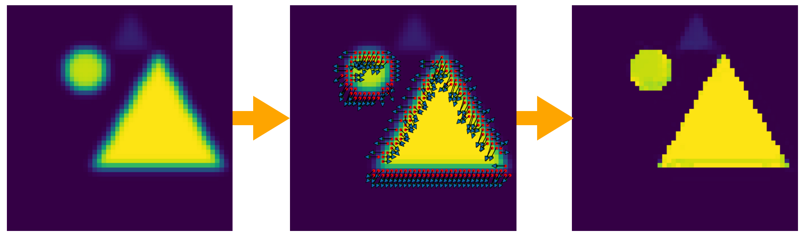
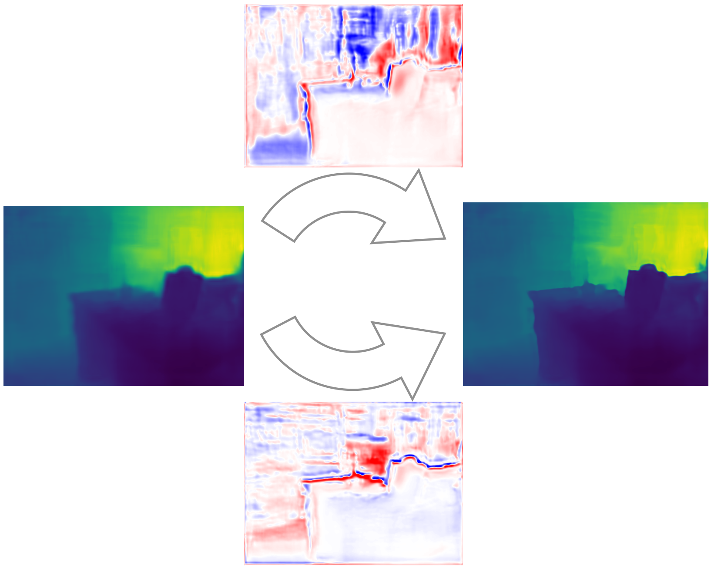

# Displacement_Field

## Visualization
### 1D

### 2D


## Requirements:
- PyTorch >= 0.4
- OpenCV
- CUDA >= 8.0(Only tested with CUDA >= 8.0)

## Data Preparation
```bash
sh download.sh
```

## Training
```bash
#Use depth only as input
cd model/nyu/df_nyu_depth_only
python train.py -d 0

#Use RGB image as guidance
cd model/nyu/df_nyu_rgb_guidance
python train.py -d 0
```
## Citation
```bash
@InProceedings{Ramamonjisoa_2020_CVPR,
author = {Ramamonjisoa, Michael and Du, Yuming and Lepetit, Vincent},
title = {Predicting Sharp and Accurate Occlusion Boundaries in Monocular Depth Estimation Using Displacement Fields},
booktitle = {IEEE/CVF Conference on Computer Vision and Pattern Recognition (CVPR)},
month = {June},
year = {2020}
}
```

## Acknowledgement
The code is based on [TorchSeg](https://github.com/ycszen/TorchSeg)
